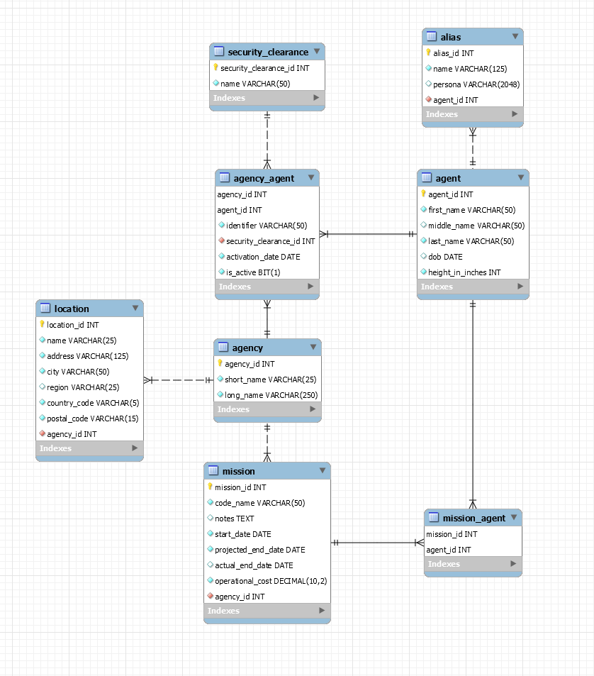

# M07 Assessment: Field Agent API

### Goals
* Complete new features in the field-agent project. Use existing code as much as possible. It's important to understand what you have before you write new code.

### High Level Requirements
* Create full HTTP CRUD for security clearance.
* Create full HTTP CRUD for agent aliases.
* Implement global error handling.

### Set Up
1. Download Field Agent Project
2. Extract it.
3. Open `field-agent` with IntelliJ.
4. Build the project.

The project is a REST API that uses Spring Boot, Spring MVC, Spring JDBC, and Spring Testing. It's built on top of the field_agent schema.

### Features
Implement three new features in the numbered priority order.

1. Security Clearance
  * There is an existing `SecurityClearance` model, but no specific repository, service, or `@RestController`. Implement these classes to provide full HTTP access to security clearances.
    * API users should be able to:
      * Find all security clearances.
      * Find a security clearance by its identifier.
      * Add a security clearance. 
      * Update an existing security clearance.
      * Delete a security clearance. (This requires a strategy. It's probably not appropriate to delete agency_agent records that depend on a security clearance. Only allow deletion if a security clearance key isn't referenced.)
    * **Domain Rules**
      1. Security clearance name is required.
      2. Name cannot be duplicated.

2. Aliases
  * An agent has a one-to-many relationship with aliases. An alias is an assumed identity. It's a name and optional persona (description of the identity) under which the agent operates. Aliases aren't required. Some agents have many.
  * The `alias` table exists in the database, but there's no accompanying Java code. Implement the classes and methods required to support aliases in the REST API. Consider your options. Aliases are not independent. They are attached to an agent.
  * API users should be able to:
    * Fetch an individual agent with aliases attached.
    * Add an alias.
    * Update an alias.
    * Delete an alias. (No strategy required. An alias is never referenced elsewhere.)
  * **Domain Rules**
    1. Name is required.
    2. Persona is not required unless a name is duplicated. The persona differentiates between duplicate names.
    
3. Global Error Handling
    * The current code makes no attempt to manage data integrity issues. If we try to reference a record that doesn't exist or insert a duplicate key, we get a `RuntimeException`.
    * Use the `@ControllerAdvice` annotation to register an exception handler for all controllers. Catch and handle exceptions at two levels.
      1. Determine the most precise exception for data integrity failures and handle it with a specific data integrity message.
      2. For all other exceptions, create a general "sorry, not sorry" response that doesn't share exception details.
    
### Technical Requirements
* Do not change the database schema. Only Java changes are required.
* Use Spring to make your life easier. Specifically, use as much Spring Testing as possible to save steps.
* Test both data and domain layer components. The `@MockBean` isn't required for domain testing, but if you don't use it you must create a test double. Controller testing isn't strictly required, but try to test at least one HTTP endpoint with a mock web server. It might be interesting to trigger global exception handling.
* Tests must never run against the production database. They run against the test database.

### Approach
* Plan before you write code. In particular, map out the existing code and ensure that you understand it. If there's code that partially solves a problem, use it. You may not receive full credit if you reimplement something that already exists.
* Requirements are very high level. You must discuss with your instructor to clarify and refine. Don't make assumptions. Verify with your instructor. Ask questions.
* Work back-to-front or front-to-back. Test as you go. Don't jump around. If you work front-to-back, you'll need some sort of mocked service to validate your HTTP endpoints.
* Save HTTP requests in a `.http` file. Then execute them with REST Client to verify endpoints. Testing should get you most of the way, but it's still important to exercise the running application before you turn it in.

### Stretch Goals
* Implement full HTTP CRUD for `mission`.
* Implement full HTTP CRUD for the mission/agent many-to-many relationship.
* Implement a database logging strategy for global exceptions. (It's okay to alter database schema for this goal.) It's possible to disable detailed exception messages via configuration, so that's not the real value of global exception handling. The real value is the ability to log exceptions and track their behavior. 
* Create a database table, a repository, and possibly a service (maybe pass-through?) to log exceptions to the database.

# Planning
  
### Basic Questions
  * What are the requirements for the project?
    * High Level Requirements
      * Create full HTTP CRUD for security clearance.
      * Create full HTTP CRUD for agent aliases.
      * Implement global error handling.
    * Technical Requirements
      * Do not change the database schema. Only Java changes are required.
        * However, can alter known good state of test database.
      * Use Spring to make your life easier. Specifically, use as much Spring Testing as possible to save steps.
      * Test both data and domain layer components. The `@MockBean` isn't required for domain testing, but if you don't use it you must create a test double. Controller testing isn't strictly required, but try to test at least one HTTP endpoint with a mock web server. It might be interesting to trigger global exception handling.
      * Tests must never run against the production database. They run against the test database.
  * Are there any requirements that I need to get clarification on?
    * Everything seems clear as of now.
  * Do I have to do any research?
    * Exception classes for different codes that need caught in the GlobalExceptionHandler
  * Are there any unknowns? What do I need to do to get clarity?
    * N/A.
  * What are my primary tasks?
    * Create an Alias Java model class.
    * Create JdbcTemplateRepository classes for both SecurityClearance and Alias.
    * Create Service classes for both SecurityClearance and Alias.
    * Create Controller classes for both SecurityClearance and Alias.
    * Create GlobalExceptionHandler class
      * Implement `@ControllerAdvice` to handle controller exceptions without sharing exception details in the HTTP response.
    * Create ErrorResponse class to return different messages according to the exception reached.
  * Are there any dependencies between tasks? What order do I need to complete the tasks in?
    * Will want to work back-end to front-end. Testing will be generated alongside each class.
      1. Models
      2. Repository
      3. Service
      4. Controllers
      5. Global Error Handling

### Review Existing Project
  * How will I review the provided database?
    * I will reverse-engineer a diagram for the `field_agent` database and review table fields and relationships.
  * How will I review the provided code?
    * The Q&A on Friday morning provided a good base understanding of the code's structure.
    * I will look through the tests and analyze the models/repositories to further my understanding of the Java representation of the data.
  

### What classes and methods do I need to add to the project?

#### SecurityClearance
* Agency/AgencyAgent (classes already exist)
  * Not sure if changes need made yet, but need to go through and make sure that security clearances are fully integrated
    * They appear to be at first glance.
* Class: SecurityClearance (model)
  * `int securityClearanceId;`
  * `String name;`
  * getters and setters
* Class: SecurityClearanceJdbcTemplateRepository (with tests)
  * `findAll()` -> List<SecurityClearance>
  * `findById(int securityClearanceId)` -> SecurityClearance
  * `add(SecurityClearance securityClearance)` -> SecurityClearance
  * `update(SecurityClearance securityClearance)` -> boolean
  * `deleteById(int securityClearanceId)` -> boolean
* Class: SecurityClearanceService (with tests)
  * `findAll()` -> List<SecurityClearance>
  * `findById(int securityClearanceId)` -> SecurityClearance
  * `add(SecurityClearance securityClearance)` -> Result<SecurityClearance>
  * `update(SecurityClearance securityClearance)` -> Result<SecurityClearance>
  * `deleteById(int securityClearanceId)` -> boolean
    * Need validation to make sure that it is not used by any agency_agent records
      * Will use stream to check anyMatch() on AgencyAgent.getSecurityClearance().getSecurityClearanceId()
      * Believe I will search through all Agencies (AgencyService.findAll()) to grab all AgencyAgent objects
        * I will look at other options when I get here, not sure if AgencyService is the best place to go
* Class: SecurityClearanceController
  * GET `findAll()` - List<SecurityClearance>
  * GET `findById(@PathVariable int securityClearanceId)` returns ResponseEntity<`SecurityClearance`>
  * POST `add(@RequestBody SecurityClearance securityClearance)` returns ResponseEntity<`SecurityClearance`>
  * PUT `update(@RequestBody SecurityClearance securityClearance)` returns ResponseEntity<`Object`>
  * DELETE `delete(@PathVariable securityClearanceId)` returns ResponseEntity<Void>

#### Alias
* Agent (classes already exist)
  * Need to incorporate attached Aliases
    * Add `List<Alias>` field to model (plus getter/setter)
    * Add `addAliases()` to `AgentJdbcTemplateRepository`
    * Call `addAliases(agent)` in `AgentJdbcTemplateRepository.findById()` if agent != null
* Class: Alias (model)
  * `int aliasId;`
  * `String name;`
  * `String persona;`
  * `int agentId;`
  * getters and setters
* Class: AliasJdbcTemplateRepository (with tests)
  * `findAll()` -> List<Alias>
  * `findById(int aliasId)` -> Alias
  * `add(Alias alias)` -> Alias
  * `update(Alias alias)` -> boolean
  * `deleteById(int aliasId)` -> boolean
* Class: AliasService (with tests)
  * `findAll()` -> List<Alias>
  * `findByAgentId()` -> List<Alias>
  * `findById(int aliasId)` -> Alias
  * `add(Alias alias)` -> Result<Alias>
  * `update(Alias alias)` -> Result<Alias>
  * `deleteById(int aliasId)` -> boolean
* Class: AliasController
  * GET `findAll()` - List<Alias>
  * GET `findByAgentId(@PathVariable int agentId)` - ResponseEntity<List<Alias>>
  * GET `findById(@PathVariable int aliasId)` returns ResponseEntity<`Alias`>
  * POST `add(@RequestBody Alias alias)` returns ResponseEntity<`Object`>
  * PUT `update(@RequestBody Alias alias)` returns ResponseEntity<`Object`>
  * DELETE `delete(@PathVariable aliasIs)` returns ResponseEntity<`Void`>
  
#### GlobalExceptionHandler
* Class: GlobalExceptionHandler
  * Will contain a custom method for each exception I track down.
  * Finally, any unhandled exception will be caught by a final method catching Exception.class:
    * @ExceptionHandler(Exception.class)
      public ResponseEntity<ErrorResponse> handleException(Exception ex) {
        return new ResponseEntity<ErrorResponse>(
        new ErrorResponse("`Error message here`"),
        HttpStatus.INTERNAL_SERVER_ERROR);
      }
* Class: ErrorResponse
  * private final LocalDateTime timestamp = LocalDateTime.now();
  * private final String message;
  * public LocalDateTime getTimestamp() { return timestamp; }
  * public String getMessage() { return message; }
  * public ErrorResponse(String message) { this.message = message; }

### HTTP Methods

#### Security Clearance

  * findAll: `GET /api/security_clearance`
    * Always returns: securityClearanceService.findAll()
  * findById(int): `GET /api/security_clearance/{securityClearanceId}`
    * Success: ResponseEntity.ok(securityClearance)
    * If Null: ErrorResponse.build(result)
  * add(SecurityClearance): `POST /api/security_clearance/`
    * Success: ResponseEntity<>(result.getPayload, HTTPStatus.CREATED)
    * If add fails: ResponseEntity<>(HTTPStatus.NOT_FOUND)
  * update(SecurityClearance, int): `PUT /api/security_clearance/{securityClearanceId}`
    * Success: ResponseEntity<>(HTTPStatus.NO_CONTENT)
    * ID does not match: ResponseEntity<>(HttpStatus.CONFLICT)
    * If update fails: ErrorResponse.build(result)
  * delete(int): `DELETE /api/security_clearance/{securityClearanceId}`
    * Success: ResponseEntity<>(HttpStatus.NO_CONTENT)
    * If ID not found: ResponseEntity<>(HttpStatus.NOT_FOUND)
      
#### Alias
  * findById(int): `GET /api/alias/{aliasId}`
    * Success: ResponseEntity.ok(alias)
    * If null: ErrorResponse.build(result)
  * add(Alias): `POST /api/alias`
    * Success: ResponseEntity<>(result.getPayload(), HttpStatus.CREATED)
    * If add fails: ErrorResponse.build(result)

Database Access Strategies
* What will my strategy be for deleting security clearances?
  * I will use validation to ensure that no AgencyAgent instances use the securityClearanceId that is up for deletion. If any do, it will abandon the operation and return an error message.
* How will I fetch an individual agent with their aliases attached?
  * I will add the method `addAliases` to `AgentJdbcTemplateRepository.findById` to populate aliases when the method also populates agencies

Exception Handling Strategies
* How will I implement global error handling?
  * I will create a `GlobalExceptionHandler` class and an `ErrorResponse` class in line with the lessons and Q&A this morning.
* How will I determine the most precise exception to handle when data integrity failures occur?
  * I will attempt the "poke and break" technique, submitting different HTTP requests and seeing which exceptions it returns.

Testing Strategies
* What unit tests do I need to write to fully test my new classes?
  * I need to test all CRUD methods for my SecurityClearance/Alias Data and Service classes.
  * I also need to add tests for any methods that I alter in Agent Data/Service classes (and potentially AgencyService classes)
* What will I do to ensure that my unit tests never run against the production database?
  * I need to ensure that I am using the field_agent_test database for my data layer tests, and a mock repository for other layers.
* Do I need to do anything to establish a known good state for my repository unit tests?
  * There is already a set_known_good_state function in the test repository schema, but I will need to go over its insertions to make sure that it is compatible with the new features
* Will I use test doubles or mocking when testing my service classes?
  * I will use mocking when testing my service classes.
* What are my plans for controller testing?
  * Since controller tests are not required, I will put those on the back burner and focus on building an MVP.
  * If time allows, I will use mocking for the repository and autowire a MockMvc for testing

Stretch Goals:
  * Implement full HTTP CRUD for `mission`.
  * Implement full HTTP CRUD for the `mission`/`agent` many-to-many relationship.
  * Implement global exception logging

## Total Time

* MVP Estimated Time: 15.25 hours
* MVP Actual Time: 9.75 hours
  
* Stretch Estimated Time: 7.25 hours
* Stretch Actual Time: 6.75 hours

* Total Estimated Time: 22.5 hours
* Total Actual Time: 16.5 hours

# Tasks

* [x] SecurityClearance Data Layer
  * Estimated Time: 1 hours
  * Actual Time: 30 minutes
  
* [x] SecurityClearance Data Layer Tests
  * Estimated Time: 45 minutes
  * Actual Time: 30 minutes
  
* [x] SecurityClearance Domain Layer
  * Estimated Time: 1.5 hours
  * Actual Time: 45 minutes
  
* [x] SecurityClearance Domain Layer Tests
  * Estimated Time: 45 minutes
  * Actual Time: 45 minutes
   
* [x] SecurityClearance Controller
  * Estimated Time: 2 hours
  * Actual Time: 45 minutes

* [x] Alias Model
  * Estimated Time: 15 minutes
  * Actual Time: 30 minutes

* [x] Alias Data Layer
  * Estimated Time: 2 hours
  * Actual Time: 30 minutes

* [x] Alias Data Layer Tests
  * Estimated Time: 45 minutes
  * Actual Time: 30 minutes

* [x] Alias Domain Layer
  * Estimated Time: 1.5 hours
  * Actual Time: 45 minutes

* [x] Alias Domain Layer Tests
  * Estimated Time: 45 minutes
  * Actual Time: 2.5 hours

* [x] Alias Controller
  * Estimated Time: 2 hours
  * Actual Time: 45 minutes
  
* [x] Global Error Handling
  * Estimated Time: 2 hours
    * 1 hour for basic development, another hour for poking and breaking.
  * Actual Time: 1 hour
  
## Stretch Goal (Global Exception Logging):

### Plan
* Update DB Schema and TestSchema
  * Table logged_exception (logged_exception_id, status_code, original_message, displayed_message, exception_timestamp)
* LoggedException (model)
* LoggedExceptionJdbcRepository
  * findAll() - for our convenience
  * add() - logs a caught exception to the database
* LoggedExceptionService
  * findAll()
  * add()
  * validate() - private
  * Validation may be unnecessary since all occurrences of a caught exception will have valid fields, but to be safe we will include it
* Will generate testing as I go
* Update GlobalExceptionHandler to create LoggedException objects and add to DB before returning ResponseEntity

### Tasks
* [x] LoggedException DB updates
  * Estimated Time: 30 minutes
  * Actual Time: 30 minutes
* [x] LoggedException (model)
  * Estimated Time: 30 minutes
  * Actual Time: 15 minutes
* [x] LoggedException data layer
  * Estimated Time: 45 minutes
  * Actual Time: 30 minutes
* [x] LoggedException domain layer
  * Estimated Time: 30 minutes
  * Actual Time: 30 minutes
* [x] LoggedException GlobalExceptionHandler updates
  * Estimated Time: 30 minutes
  * Actual Time: 30 minutes

## Stretch Goal (Global Exception Logging):

### Plan
* Update DB Schema and TestSchema
  * Table logged_exception (logged_exception_id, status_code, original_message, displayed_message, exception_timestamp)
* LoggedException (model)
* LoggedExceptionJdbcRepository
  * findAll() - for our convenience
  * add() - logs a caught exception to the database
* LoggedExceptionMapper
* LoggedExceptionService
  * findAll()
  * add()
  * validate() - private
  * Validation may be unnecessary since all occurrences of a caught exception will have valid fields, but to be safe we will include it
* Will generate testing as I go
* Update GlobalExceptionHandler to create LoggedException objects and add to DB before returning ResponseEntity

### Tasks
* [x] LoggedException DB updates
  * Estimated Time: 30 minutes
  * Actual Time: 30 minutes
* [x] LoggedException (model)
  * Estimated Time: 30 minutes
  * Actual Time: 15 minutes
* [x] LoggedException data layer
  * Estimated Time: 45 minutes
  * Actual Time: 30 minutes
* [x] LoggedException domain layer
  * Estimated Time: 30 minutes
  * Actual Time: 30 minutes
* [x] LoggedException GlobalExceptionHandler updates
  * Estimated Time: 30 minutes
  * Actual Time: 30 minutes
  
## Stretch Goal (Mission HTTP CRUD)

### Plan
* Add mission insert statements to set_known_good_state for testing
* Mission (model)
* MissionJdbcTemplateRepository
* MissionMapping
* MissionService
* MissionController

### Tasks
* [x] Mission DB updates
  * Estimated Time: 15 minutes
  * Actual Time: 15 minutes
* [x] Mission (model)
  * Estimated Time: 15 minutes
  * Actual Time: 15 minutes
* [x] Mission data layer
  * Estimated Time: 1 hour 30 minutes
  * Actual Time: 1 hour
* [x] Mission domain layer
  * Estimated Time: 1.5 hours
  * Actual Time: 2 hours
* [ ] Mission Controller
  * Estimated Time: 30 minutes
  * Actual Time: 45 minutes
* [x] Agency updates to include List<Mission> (including Transactional delete in repo)
  * Estimated Time: 30 minutes
  * Actual Time: 15 minutes

#### Research
* [x] Exception classes to catch in handler (for AgencyController tests)
  * HttpMessageNotReadableException
  * HttpMediaTypeNotSupportedException

#### Misc

* Submit your assessment in the LMS
  * Okay to use your GitHub repo for your assessment code
  * Submit a text file with the URL to the folder within your repo
  * Assessments are due at the beginning of class on Monday
  * Send your estimated completion percent to your code reviewer
* Group code reviews on Monday
  * You'll be presenting your projects to James, Kiel, or Irina and one of your classmates
  * Everyone will get a chance to review someone else's project (not the same person that you presented to)
  * Only your instructor's or TA's grade will be recorded in the LMS
  * You'll have up to 15 minutes to present your project and then the remaining time will be used to ask questions and/or provide feedback... **please come prepared with talking points so that you make the most of your time**
  * We'll publish a schedule on Monday morning (some reviews will take place after class)
* You'll have until the end of next week to correct any issues and re-submit for an updated, final grade
* Submit your plan to your code reviewer this afternoon
  * We'll publish the review groupings in Teams
  * We're available to answer questions or review your plans via Teams if you get stuck or are unsure about your plan